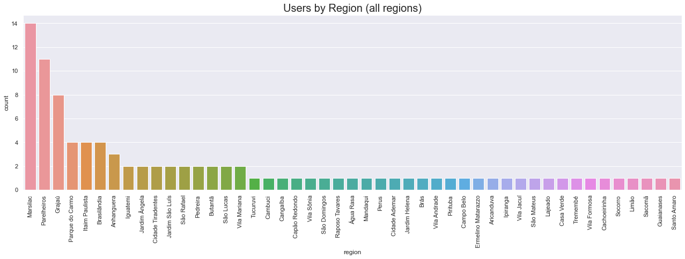
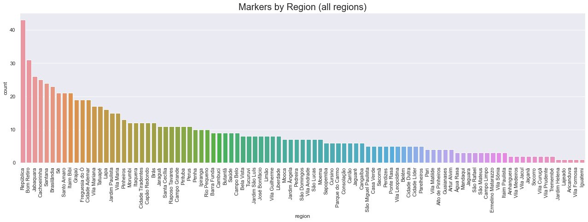

# View

## Users by Region

Total number of users: **789** _(100%)_
Users not in a region **692** _(87.71%)_
Users in a region: **97** _(12.29%)_

## Markers by Region

Total number of markers: **1000** _(100%)_
Markers not in a region: **149** _(14.9%)_
Markers in a region: **851** _(85.1%)_

